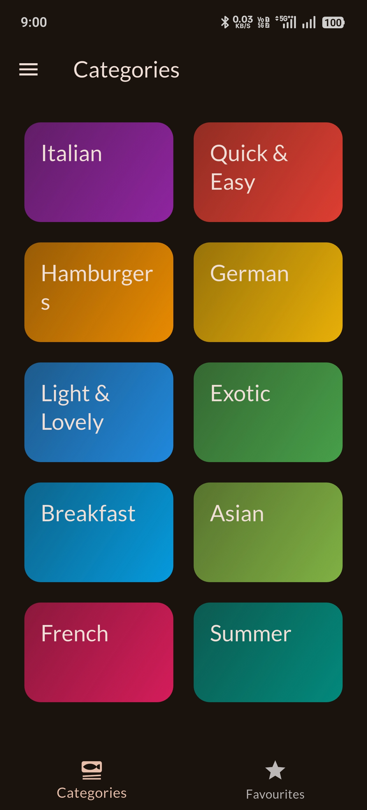
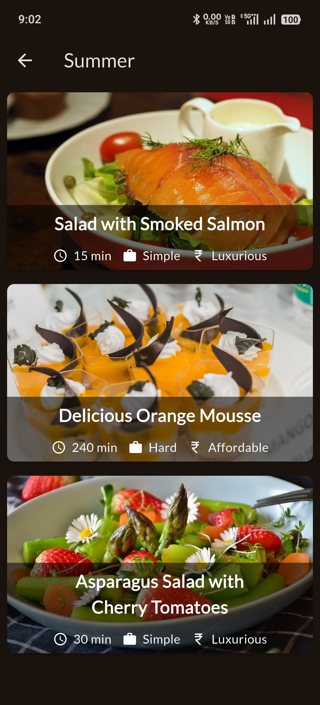
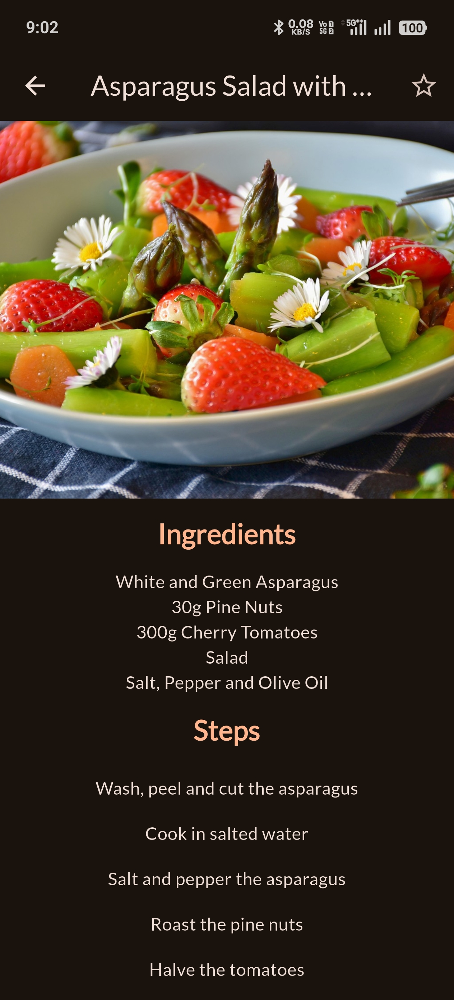
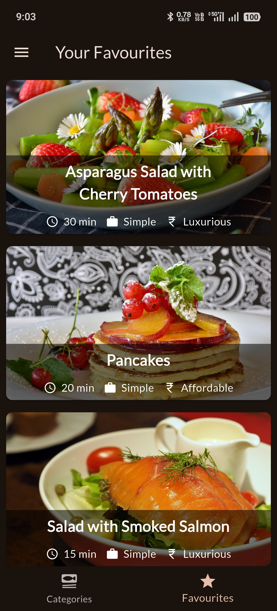
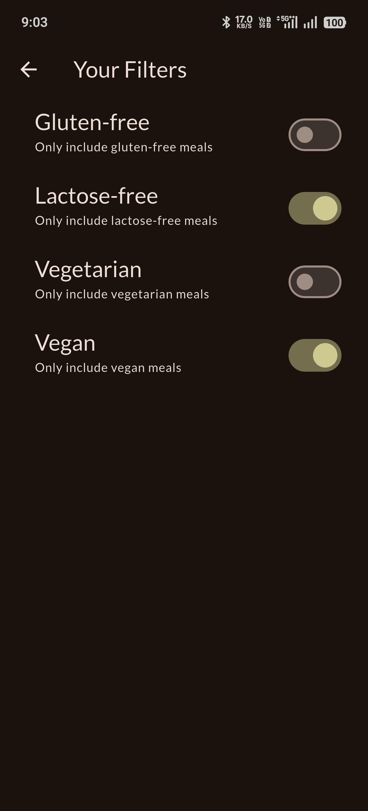
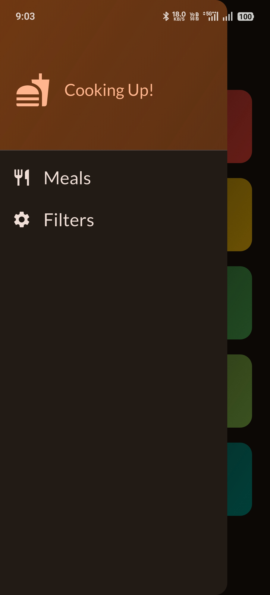

# Flutter Meals App 🍽️📱

A clean, feature-rich Flutter meals application demonstrating Riverpod-based state management,
smooth multi-screen navigation, and reactive UI updates driven by dietary filter preferences.

The project uses **Riverpod** for global state management, keeping filter state, favourites,
and meal data consistently reactive and well-separated from the UI layer.

---

## ✨ Features

- Category-based meal browsing with a colorful grid layout
- Meals list screen per category with image cards showing cook time, complexity, and affordability
- Full meal detail screen with ingredient list and step-by-step cooking instructions
- Favourite meals toggle via app bar icon with persistent Riverpod state
- Dedicated Favourites tab showing all starred meals
- Dietary filter support: Gluten-free, Lactose-free, Vegetarian, and Vegan
- Filters applied globally — meal lists update reactively across all screens
- Side drawer navigation with quick access to Meals and Filters screens
- Dark-themed UI with warm, food-inspired color palette

---

## 🧱 Architecture & Design Decisions

- **Riverpod for Global State**
  - `FiltersNotifier` manages active dietary filters as a `Map<Filter, bool>` using `StateNotifier`
  - `FavouritesNotifier` manages the list of favourited meals reactively
  - `filteredMealsProvider` derives the visible meal list by applying active filters on top of the full dataset — computed, not stored

- **Explicit state vs derived data separation**
  - Mutable state: active filters and the favourites list
  - Derived data: filtered meal list computed on demand from `mealsProvider` + `filtersProvider`

- **Predictable state updates**
  - Filter toggles update the entire filter map via `copyWith`-style replacement
  - Favourite toggle checks current state and adds/removes accordingly, triggering reactive rebuilds

- **Clean navigation structure**
  - `TabsScreen` acts as the root shell managing Categories and Favourites tabs
  - Drawer provides app-wide navigation to Filters screen
  - Named push navigation carries category context into `MealsScreen` and further into `MealDetailScreen`

- **Reusable UI components**
  - `CategoryGridItem` for the home grid
  - `MealItem` for list cards with metadata chips
  - Consistent meal detail layout with hero image, ingredients, and steps sections

---

## 🛠 Tech Stack

- Flutter (Material)
- Dart
- flutter_riverpod (state management)

---

## 📸 Screenshots

| Categories | Meals List | Meal Detail |
|---|---|---|
|  |  |  |

| Favourites | Filters | Drawer |
|---|---|---|
|  |  |  |

---

## 🧠 Key Takeaways

- Riverpod enables clean separation between raw data, derived state, and UI
- `StateNotifier` makes complex state mutations explicit and testable
- Derived providers keep filtered data in sync automatically without manual triggers
- Keeping providers small and focused makes the app easy to reason about
- Navigation can carry context cleanly without bloating global state

---

## 🔮 Possible Enhancements

- Persist favourites locally (SharedPreferences / Hive)
- Add search functionality across all meals
- Add meal ratings and user reviews
- Add unit/widget tests for filter logic and provider state
- Expand meal data with nutrition info and serving sizes

---

## 👨‍💻 Author

**GOKUL HARI**  
Software Engineer